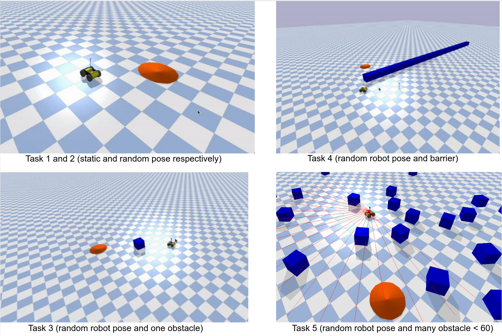
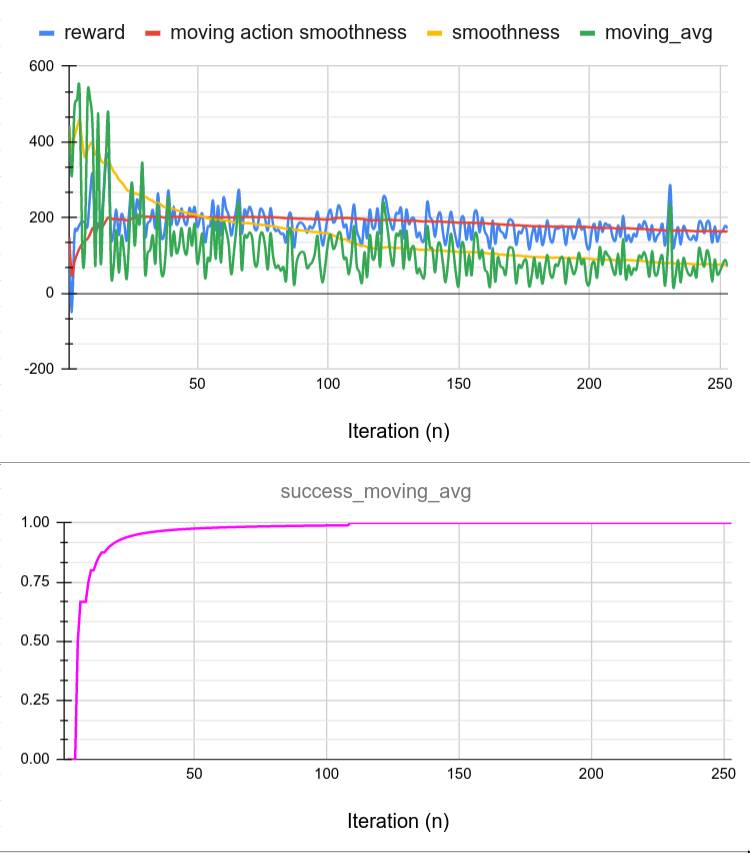

# Deep_Learning_For_Robot_Navigation

Mobile robot navigation has many real-world use cases including disaster relief, rescue and patrolling. Traditional heuristic based mobile robot navigation methods
have many limitations, providing a motivation to seek alternative approaches. 

This project aims **to determine whether deep learning neural networks can be used to effectively solve mobile robot navigation tasks**. Using a Husky robot in a simulated environment three state of the art deep learning techniques were evaluated using navigation tasks with varying degrees of difficulty. 

The approach of using 5 stages of task difficulty was highly successful in implementing and evaluating both Deep Q Learning (DQN) and Proximal Policy Optimisation (PPO). The reward shaping process produced a reward function that allowed the Husky to solve complex navigation tasks using such algorithms. PPO was identified as the most suitable deep learning algorithm due to its superior convergence time.

## Simulated environments
There are 5 different navigation task difficulty levels that a model can be trained on. The tasks are described below:

<p align="center">
 
</p>

1. Task 1 involves a static husksy starting position and a fixed goal position.
2. Task 2 involves a random husky starting orientation and a random goal position.
3. Task 3 involves a random husky orientation and 1 obstacle between the husky and the goal (that is randomly positioned).
4. Task 4 involves a random husky orientation and a wall in between the husky and the goal.
5. Task 5 involves a random husky orientation and n randomly positioned obstacles. 

You can have a look at the tasks by running the husky_env.py file after you have completed the installation process with:
```
python husky_env.py [task number e.g., 5]
```
you can use the arrow keys to move around the environment as well. 

# Installation

## Tested version
This repository tested with the following versions and it's not guaranteed to work with other versions.

| Software | Version |
| --- | --- |
| Ubuntu | 18.04.5 LTS |
| Linux Kernel | 5.4.0-65-generic |
| OpenAI gym | 0.18.3|
| Stable-baselines | 2.10.2 |
| OpenAI gym | 0.18.0 |
| Python | 3.7.10 |
| PyBullet | 3.1.7 |
| Tensorflow | 1.15.0 |
| Tensorboard | 1.15.0 |

Detail package version information can be found from [environment.yml](environment.yml)

- ensure you have conda installed, see: https://docs.conda.io/projects/conda/en/latest/user-guide/install/index.html

clone the repo: 
```
git clone https://github.com/JorgeMuehlebach/Deep_Learning_For_Robot_Navigation.git
```

Create a conda environment with python3.7

```
conda create --name RobotNavigationML python=3.7
```

and activate the conda environment:

```
conda activate RobotNavigationML
```
(Note that `RobotNavigationML` is prefixed in your terminal console (e.g., `(RobotNavigationML) username$path` which means the conda env is activated and all packages will be installed in that env)

manually install packages
```
(RobotNavigationML)pip install pybullet==3.1.7 tensorflow==1.15.0 gym==0.18.3 pynput pandas stable_baselines=2.10.2
```

# START TRAINING!

As shown above, we provide 5 environments with varying level of diffculties (e.g., 1 is easiest and 5 is the most difficult). 

```
(RobotNavigationML)cd src
```

You can easily choose one of them by just changing task number.

```
(RobotNavigationML)python TrainHuskyRL.py [task number e.g., 2]
```
As the model is training, information about its progress will be printed to the console as shown below.

```bash
episodes: 1
stopping character:  F
this episodes reward:  -88.36766625460058
avg episode reward:  -88.36766625460058
success rate:  0.0
--------------------------------------
| approxkl           | 0.0010377939  |
| clipfrac           | 0.0           |
| ep_len_mean        | 42            |
| ep_reward_mean     | -88.4         |
| explained_variance | -0.0282       |
| fps                | 83            |
| n_updates          | 1             |
| policy_entropy     | 2.8380501     |
| policy_loss        | -0.0049219145 |
| serial_timesteps   | 128           |
| time_elapsed       | 1.03e-05      |
| total_timesteps    | 128           |
| value_loss         | 319.33267     |
--------------------------------------
---------------------------------------
| approxkl           | 0.00045663456  |
| clipfrac           | 0.0            |
| ep_len_mean        | 42             |
| ep_reward_mean     | -88.4          |
| explained_variance | -0.0344        |
| fps                | 102            |
| n_updates          | 2              |
| policy_entropy     | 2.8383286      |
| policy_loss        | -0.00031569728 |
| serial_timesteps   | 256            |
| time_elapsed       | 1.53           |
| total_timesteps    | 256            |
| value_loss         | 2.78138        |
---------------------------------------
FAILED
episodes: 2
stopping character:  F
this episodes reward:  -43.50275077217358
avg episode reward:  -65.93520851338708
success rate:  0.0
...
```


Once it has trained sufficiently (e.g., success rate: 0.95) then you can stop the training and save the model by entering the trial letter. The trial letter by default is set to `A` (capital A), so pressing `A` will save the model to the results folder (e.g., `src/results/Husky_resultA.zip`). 

There will also be data related to training saved to the stats file that can be used at your discretion. You can plot the results with any convient plotting tools, here we share some sample results plot that shows how the success rate and reward increased throughout training using [Google sheet](https://docs.google.com/spreadsheets/d/1e2fM4iarxzmstk_c3jr3W_83TRPD5mqlknwlM9f07PQ/edit?usp=sharing).

<p align="center">

</p>


# Run the model
Show the husky completing the task you just trained it to complete by running the following command
```
python Running_A_Saved_Model.py [task number e.g., 2]
```
ensure that the task number is the same for both training and running 

# Changing the algorithm to DQN and PPO
By default it uses PPO to solve the tasks. To change the algorithm to DQN just open both the TrainHuskyRL.py and the Running_A_Saved_Model.py and change the parameters that are being passed into the main methods.
 To use GAIL run the following command:
 ```
 python TrainingAndRunningGail.py
 ```
 in order for this command to work you must have an already trained model available for the task you wish to train it on. Then you must go into the TrainingAndRunningGail.py file and modify the path to that file along with which task difficulty it is. GAIL takes about 5 hours to train on my computer and only works for task 2. I would be interested if others could get it working for more diffult tasks.

See https://stable-baselines.readthedocs.io/en/master/ for the algorithm implentations used for PPO, DQN and GAIL.


# Publication

If our work helps your works in an academic/research context, please consider to cite the following publication:

* Jorge Alfred Muehlebach, **"Deep Learning Neural Networks for Mobile Robot Navigation"**, 2021, Bachelor thesis, the University of Queensland. ([PDF](https://arxiv.org/link))

```bibtex
@inproceedings{jorge2021rl-navigation,
  title={Deep Learning Neural Networks for Mobile Robot Navigation},
  author={Jorge Alfred Muehlebach},
  booktitle={Bachelor thesis},
  year={2021},
  organization={the University of Queensland}
}
```

